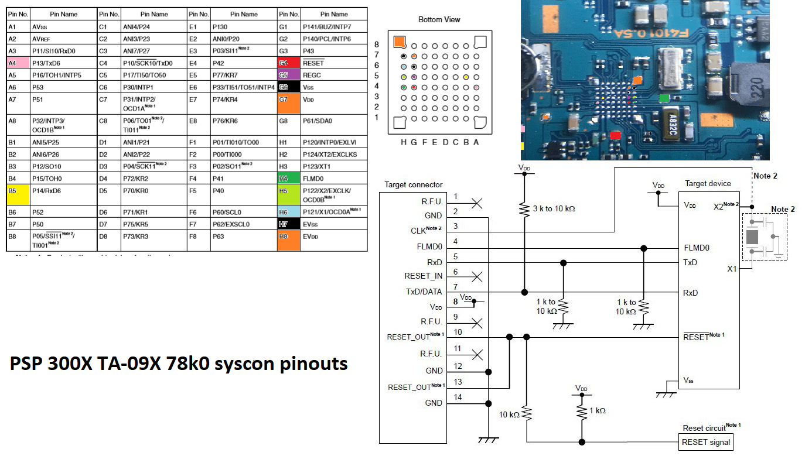

# 78K0 set security glitchtool
78k0 rom corrupter..., errrm i mean security byte glitch tool!



Needs extclk, in the code its for 8.33MHz, 78k0 manual says 1 to 100MHz can work. 
Change cmd_baud_set to do so.

Also change
```#define SEC_BYTE 0x68```
to the byte that your current signature displays, so it knows when it changes.
